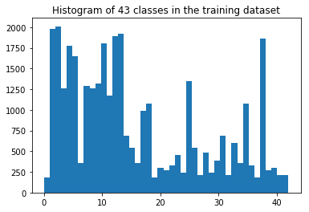
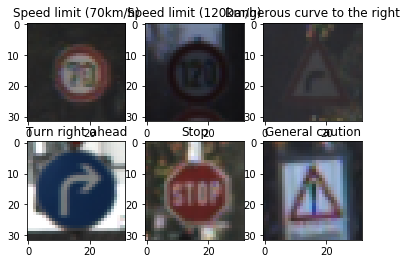
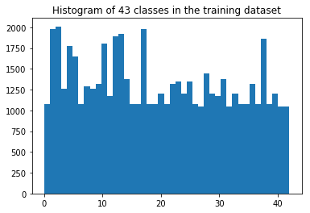
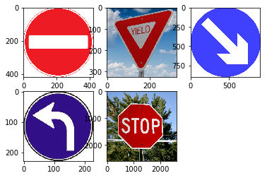


# Self-Driving Car Engineer Nanodegree

## Deep Learning

### Project: Build a Traffic Sign Recognition Classifier
---
## Step 0: Load The Data


```python
from tensorflow.examples.tutorials.mnist import input_data
import pickle
import numpy as np

# Details of file containg train, validation and test data details
training_file = 'train.p'
validation_file= 'test.p'
testing_file = 'valid.p'

with open(training_file, mode='rb') as f:
    train = pickle.load(f)
with open(validation_file, mode='rb') as f:
    valid = pickle.load(f)
with open(testing_file, mode='rb') as f:
    test = pickle.load(f)
    
X_train, y_train = train['features'], train['labels']
X_valid, y_valid = valid['features'], valid['labels']
X_test, y_test = test['features'], test['labels']

X_test1 = X_test
y_test1 = y_test

assert(len(X_train) == len(y_train))
assert(len(X_valid) == len(y_valid))
assert(len(X_test) == len(y_test))
```

---

## Step 1: Dataset Summary & Exploration

The pickled data is a dictionary with 4 key/value pairs:

- `'features'` is a 4D array containing raw pixel data of the traffic sign images, (num examples, width, height, channels).
- `'labels'` is a 1D array containing the label/class id of the traffic sign. The file `signnames.csv` contains id -> name mappings for each id.
- `'sizes'` is a list containing tuples, (width, height) representing the original width and height the image.
- `'coords'` is a list containing tuples, (x1, y1, x2, y2) representing coordinates of a bounding box around the sign in the image. **THESE COORDINATES ASSUME THE ORIGINAL IMAGE. THE PICKLED DATA CONTAINS RESIZED VERSIONS (32 by 32) OF THESE IMAGES**

Complete the basic data summary below. Use python, numpy and/or pandas methods to calculate the data summary rather than hard coding the results. For example, the [pandas shape method](http://pandas.pydata.org/pandas-docs/stable/generated/pandas.DataFrame.shape.html) might be useful for calculating some of the summary results. 


```python
# Number of training examples
n_train = len(X_train)

# Number of validation examples
n_validation = len(X_valid)

# Number of testing examples.
n_test = len(X_test)

# Calculating The shape of an traffic sign image
image_shape = X_test[0].shape

# Calculating unique classes/labels there are in the dataset.
n_classes = len(set(y_train))

print("Number of training examples =", n_train)
print("Number of testing examples =", n_test)
print("Number of validation examples =", n_validation)
print("Image data shape =", image_shape)
print("Number of classes =", n_classes)
```

    Number of training examples = 34799
    Number of testing examples = 4410
    Number of validation examples = 12630
    Image data shape = (32, 32, 3)
    Number of classes = 43
    

#### 1. Provide a basic summary of the data set. In the code, the analysis should be done using python, numpy and/or pandas methods rather than hardcoding results manually.

I used the picke library to load and calculate summary statistics of the traffic
signs data set:

- The size of training set is 34799
- The size of the validation set is 12630
- The size of test set is 4410
- The shape of a traffic sign image is 32x32x3
- The number of unique classes/labels in the data set is 43

#### 2. Include an exploratory visualization of the dataset

Here is an exploratory visualization of the data set. It is a bar chart showing the number of images for each class.


```python
import matplotlib.pyplot as plt
from sklearn.utils import shuffle
import scipy.misc
# Visualizations will be shown in the notebook.
%matplotlib inline

number_of_classes = len(np.bincount(y_train))
plt.hist(y_train, bins=number_of_classes)
plt.title("Histogram of " + str(number_of_classes) + " classes in the training dataset")
```


    <matplotlib.text.Text at 0x7f89e2efb2e8>





```python
import numpy as np

# Method to load the label file
def load_label_file(file):
    lines = open(file).readlines()[1:]
    lines = [line.strip().split(",") for line in lines]
    label_descs = dict([ (int(classid), desc) for classid, desc in lines])
    return label_descs

label_descriptions = load_label_file("signnames.csv")

#Randomly selecting 6 figures from the train set to plot them with their labels. 
n_samples = 6
i_sample = np.random.randint(0, n_train, n_samples)
sample_images = X_train[i_sample]
sample_labels = list(map(label_descriptions.get, y_train[i_sample]))

i = 1
for img, label in zip(sample_images, sample_labels):
    # Displaing each image in a 2*6 grid     
    plt.subplot(2,3,i)
    plt.imshow(img)
    plt.title(label)
    i=i+1
    
plt.show()

```





## Step 2: Design and Test a Model Architecture
### Pre-process the Data Set (normalization, grayscale, etc.)


```python
import scipy.ndimage as sp
import cv2
import random
bincount = np.bincount(y_train)
minimim_number_of_elements_in_bin = 1000

rotated_new_images = []
rotated_new_labels = []

for i in range(len(bincount)):
    if bincount[i] < minimim_number_of_elements_in_bin:
        # Generating new images
        pictures = np.where(y_train == i)
        images_to_train = []
        labels = []
        j = 1
        while j < minimim_number_of_elements_in_bin - bincount[i]:
            for each_image_pos in pictures[0]:
                rotated_image = sp.interpolation.rotate(X_train[each_image_pos], random.randint(0,30), axes=(1,0) , reshape=True, output=None, order=3, mode='constant', cval=0.0, prefilter=True)
                rotated_image = cv2.resize(rotated_image, (32, 32))[:,:,:3]
                rotated_new_images.append(rotated_image)
                rotated_new_labels.append(i)
                j = j + 1

X_train = np.append(X_train,rotated_new_images,axis=0)
y_train = np.append(y_train,rotated_new_labels,axis=0)
      

plt.hist(y_train, bins=number_of_classes)
plt.title("Histogram of " + str(number_of_classes)+ " classes in the training dataset")    
```


    <matplotlib.text.Text at 0x7f89c4726198>





```python
# Method to convert RGB image to Gray Scale
def RGB_TO_GRAY(image_array):
    return cv2.cvtColor(image_array, cv2.COLOR_RGB2GRAY)

# Method to Normalize the Gray Scaled Image
def normalize_grayscale_image(image_array):
    a = 0.1
    b = 0.9
    greyscale_min = 0
    greyscale_max = 255.
    return a + (image_array - greyscale_min)*(b - a)/( greyscale_max - greyscale_min )

# Method to preprocess image data
def preprocess_data(image_array):
    gray_images = []
    for each_image in image_array:
        gray_images.append(RGB_TO_GRAY(each_image))
    return np.array(gray_images)
```


```python
### Preprocess the data here. It is required to normalize the data. Other preprocessing steps could include 
### converting to grayscale, etc.
from numpy import newaxis

print('Preprocessing training data...')

# Preprocessing the images
X_train_gray = preprocess_data(X_train)
X_train_gray = X_train_gray[..., newaxis]

X_test_gray = preprocess_data(X_test)
X_test_gray = X_test_gray[..., newaxis]

X_valid_gray = preprocess_data(X_valid)
X_valid_gray = X_valid_gray[..., newaxis]

X_train1 = X_train


# Normalizing the greyscale image
X_train = normalize_grayscale_image(X_train_gray)
X_test = normalize_grayscale_image(X_test_gray)
X_valid = normalize_grayscale_image(X_valid_gray)

print("The shape of the new image") 
print("Training set Image data shape =", X_train.shape)
print("Testing set Image data shape =", X_test.shape)
print("Validation set Image data shape =", X_valid.shape)

print('All figures are in normalized gray-scale.')
```

    Preprocessing training data...
    The shape of the new image
    Training set Image data shape = (57028, 32, 32, 1)
    Testing set Image data shape = (4410, 32, 32, 1)
    Validation set Image data shape = (12630, 32, 32, 1)
    All figures are in normalized gray-scale.
    


```python
def load_label_file(file):
    lines = open(file).readlines()[1:]
    lines = [line.strip().split(",") for line in lines]
    label_descs = dict([ (int(classid), desc) for classid, desc in lines])
    return label_descs

label_descriptions = load_label_file("signnames.csv")

#select samples from training data
#We will randomly select 6 figures from the train set to plot them with their labels. 
n_samples = 6
isample = np.random.randint(0, n_train, n_samples)
sample_imgs = X_train[isample]
sample_labels = list(map(label_descriptions.get, y_train[isample]))

```

#### 1. Describe how you preprocessed the image data. What techniques were chosen and why did you choose these techniques? Consider including images showing the output of each preprocessing technique. Pre-processing refers to techniques such as converting to grayscale, normalization, etc. (OPTIONAL: As described in the “Stand Out Suggestions” part of the rubric, if you generated additional data for training, describe why you decided to generate additional data, how you generated the data, and provide example images of the additional data. Then describe the characteristics of the augmented training set like number of images in the set, number of images for each class, etc.)
As a first step, I decided to generate more images using the same data set, as the data distribution across the different labels was not proper and because of which the model was not performing well for those labels, so I used the numpy library to generate new images by rotating and appended all the generated images in the original data set.

Then I used cv2 library to convert the images to gray-scale. As in traffic sign signals, shapes are more important then the color, therefore I choose to convert the colored images to the gray-scale images. Changing all the images to greyscale helped my model to learn better and faster.

Here is an example of a traffic sign image before and after grayscaling.


Data Normalization
Then I normalized the gray-scale data between .1 and .9, similar to what was discussed in one of the TensorFlow lectures. This will prevent the overfitting. The value between .1 and .9 also avoids any potential problems incurred by allowing the data to be zero.

Generate new figures from the data set, and change each class has at least 1000 exampels.
This will be shown in the next cell and discuss in the next qustions.

As a last step, I normalized the image data because I wanted the pixels intensity of all images to be in certain range. This helped me to prevent overfitting. 

Here is an example of an original image and an augmented image:

### Model Architecture


```python
import tensorflow as tf
from tensorflow.contrib.layers import flatten

EPOCHS = 50
BATCH_SIZE = 128

keep_prob1 = tf.placeholder(tf.float32)
keep_prob2 = tf.placeholder(tf.float32)

def TrafficSignClassifier(x):    
    
    mu = 0
    sigma = 0.1
    
    # Layer 1: Convolutional. Input = 32x32x1. Output = 28x28x20.
    conv1_W = tf.Variable(tf.truncated_normal(shape=(5, 5, 1, 20), mean = mu, stddev = sigma))
    conv1_b = tf.Variable(tf.zeros(20))
    conv1   = tf.nn.conv2d(x, conv1_W, strides=[1, 1, 1, 1], padding='VALID') + conv1_b

    # Activation
    conv1 = tf.nn.relu(conv1)
    
    # Droppout1
    conv1 = tf.nn.dropout(conv1, keep_prob1)

    # Pooling. Input = 28x28x20 Output = 14x14x20.
    conv1 = tf.nn.max_pool(conv1, ksize=[1, 2, 2, 1], strides=[1, 2, 2, 1], padding='VALID')

    # Layer 2: Convolutional. Input: 14x14x20, Output = 12x12x40.
    conv2_W = tf.Variable(tf.truncated_normal(shape=(3, 3, 20, 40), mean = mu, stddev = sigma))
    conv2_b = tf.Variable(tf.zeros(40))
    conv2   = tf.nn.conv2d(conv1, conv2_W, strides=[1, 1, 1, 1], padding='VALID') + conv2_b
    
    # Activation
    conv2 = tf.nn.relu(conv2)

    # Layer 2: Convolutional. Input: 12x12x40, Output = 10x10x80.
    conv3_W = tf.Variable(tf.truncated_normal(shape=(3, 3, 40, 80), mean = mu, stddev = sigma))
    conv3_b = tf.Variable(tf.zeros(80))
    conv3   = tf.nn.conv2d(conv2, conv3_W, strides=[1, 1, 1, 1], padding='VALID') + conv3_b
    
    # Activation
    conv3 = tf.nn.relu(conv3)

    # Pooling. Input = 10x10x80. Output = 5x5x80.
    conv3 = tf.nn.max_pool(conv3, ksize=[1, 2, 2, 1], strides=[1, 2, 2, 1], padding='VALID')

    # Flatten. Input = 5x5x80. Output = 2000.
    fc0   = flatten(conv3)
    
    # Layer 3: Fully Connected. Input = 2000. Output = 120.
    fc1_W = tf.Variable(tf.truncated_normal(shape=(2000, 120), mean = mu, stddev = sigma))
    fc1_b = tf.Variable(tf.zeros(120))
    fc1   = tf.matmul(fc0, fc1_W) + fc1_b
    
    # Activation
    fc1 = tf.nn.relu(fc1)
    fc1 = tf.nn.dropout(fc1, keep_prob2)
    
    # Layer 4: Fully Connected. Input = 120. Output = 84.
    fc2_W  = tf.Variable(tf.truncated_normal(shape=(120, 84), mean = mu, stddev = sigma))
    fc2_b  = tf.Variable(tf.zeros(84))
    fc2    = tf.matmul(fc1, fc2_W) + fc2_b
    
    # Activation.
    fc2    = tf.nn.relu(fc2)

    # Layer 5: Fully Connected. Input = 84. Output = 10.
    fc3_W  = tf.Variable(tf.truncated_normal(shape=(84, 43), mean = mu, stddev = sigma))
    fc3_b  = tf.Variable(tf.zeros(43))
    logits = tf.matmul(fc2, fc3_W) + fc3_b
    
    return logits
```


```python
x = tf.placeholder(tf.float32, (None, 32, 32, 1))
y = tf.placeholder(tf.int32, (None))
one_hot_y = tf.one_hot(y, 43)

rate = 0.001

logits = TrafficSignClassifier(x)
cross_entropy = tf.nn.softmax_cross_entropy_with_logits(labels=one_hot_y, logits=logits)
loss_operation = tf.reduce_mean(cross_entropy)
optimizer = tf.train.AdamOptimizer(learning_rate = rate)
training_operation = optimizer.minimize(loss_operation)
```


```python
correct_prediction = tf.equal(tf.argmax(logits, 1), tf.argmax(one_hot_y, 1))
accuracy_operation = tf.reduce_mean(tf.cast(correct_prediction, tf.float32))
saver = tf.train.Saver()

# Method to evaluate the model performance
def evaluate(X_data, y_data):
    num_examples = len(X_data)
    total_accuracy = 0
    sess = tf.get_default_session()
    for offset in range(0, num_examples, BATCH_SIZE):
        batch_x, batch_y = X_data[offset:offset+BATCH_SIZE], y_data[offset:offset+BATCH_SIZE]
        accuracy = sess.run(accuracy_operation, feed_dict={x: batch_x, y: batch_y, keep_prob1:1, keep_prob2:1})
        total_accuracy += (accuracy * len(batch_x))
    return total_accuracy / num_examples
```


```python
with tf.Session() as sess:
    sess.run(tf.global_variables_initializer())
#     saver.restore(sess, './traffic_sign_classifier_project')
    num_examples = len(X_train)
    
    print("Training...")
    print()
    for i in range(EPOCHS):
        X_train, y_train = shuffle(X_train, y_train)
        for offset in range(0, num_examples, BATCH_SIZE):
            end = offset + BATCH_SIZE
            batch_x, batch_y = X_train[offset:end], y_train[offset:end]
            sess.run(training_operation, feed_dict={x: batch_x, y: batch_y,keep_prob1:0.5,keep_prob2:0.7})
            
        validation_accuracy = evaluate(X_valid, y_valid)
        print("EPOCH {} ...".format(i+1))
        print("Validation Accuracy = {:.3f}".format(validation_accuracy))
        print()
        
    saver.save(sess, './traffic_sign_classifier_project')
    print("Model saved")
```

    Training...
    
    EPOCH 1 ...
    Validation Accuracy = 0.836
    
    EPOCH 2 ...
    Validation Accuracy = 0.905
    
    EPOCH 3 ...
    Validation Accuracy = 0.919
    
    EPOCH 4 ...
    Validation Accuracy = 0.929
    
    EPOCH 5 ...
    Validation Accuracy = 0.924
    
    EPOCH 6 ...
    Validation Accuracy = 0.931
    
    EPOCH 7 ...
    Validation Accuracy = 0.946
    
    EPOCH 8 ...
    Validation Accuracy = 0.941
    
    EPOCH 9 ...
    Validation Accuracy = 0.948
    
    EPOCH 10 ...
    Validation Accuracy = 0.945
    
    EPOCH 11 ...
    Validation Accuracy = 0.950
    
    EPOCH 12 ...
    Validation Accuracy = 0.956
    
    EPOCH 13 ...
    Validation Accuracy = 0.950
    
    EPOCH 14 ...
    Validation Accuracy = 0.954
    
    EPOCH 15 ...
    Validation Accuracy = 0.952
    
    EPOCH 16 ...
    Validation Accuracy = 0.951
    
    EPOCH 17 ...
    Validation Accuracy = 0.956
    
    EPOCH 18 ...
    Validation Accuracy = 0.953
    
    EPOCH 19 ...
    Validation Accuracy = 0.951
    
    EPOCH 20 ...
    Validation Accuracy = 0.955
    
    EPOCH 21 ...
    Validation Accuracy = 0.956
    
    EPOCH 22 ...
    Validation Accuracy = 0.961
    
    EPOCH 23 ...
    Validation Accuracy = 0.954
    
    EPOCH 24 ...
    Validation Accuracy = 0.957
    
    EPOCH 25 ...
    Validation Accuracy = 0.955
    
    EPOCH 26 ...
    Validation Accuracy = 0.947
    
    EPOCH 27 ...
    Validation Accuracy = 0.955
    
    EPOCH 28 ...
    Validation Accuracy = 0.963
    
    EPOCH 29 ...
    Validation Accuracy = 0.958
    
    EPOCH 30 ...
    Validation Accuracy = 0.964
    
    EPOCH 31 ...
    Validation Accuracy = 0.960
    
    EPOCH 32 ...
    Validation Accuracy = 0.952
    
    EPOCH 33 ...
    Validation Accuracy = 0.956
    
    EPOCH 34 ...
    Validation Accuracy = 0.953
    
    EPOCH 35 ...
    Validation Accuracy = 0.957
    
    EPOCH 36 ...
    Validation Accuracy = 0.965
    
    EPOCH 37 ...
    Validation Accuracy = 0.964
    
    EPOCH 38 ...
    Validation Accuracy = 0.961
    
    EPOCH 39 ...
    Validation Accuracy = 0.954
    
    EPOCH 40 ...
    Validation Accuracy = 0.954
    
    EPOCH 41 ...
    Validation Accuracy = 0.961
    
    EPOCH 42 ...
    Validation Accuracy = 0.958
    
    EPOCH 43 ...
    Validation Accuracy = 0.953
    
    EPOCH 44 ...
    Validation Accuracy = 0.962
    
    EPOCH 45 ...
    Validation Accuracy = 0.939
    
    EPOCH 46 ...
    Validation Accuracy = 0.969
    
    EPOCH 47 ...
    Validation Accuracy = 0.965
    
    EPOCH 48 ...
    Validation Accuracy = 0.956
    
    EPOCH 49 ...
    Validation Accuracy = 0.961
    
    EPOCH 50 ...
    Validation Accuracy = 0.968
    
    Model saved
    


```python
import tensorflow as tf
saver = tf.train.Saver()
with tf.Session() as sess:
    saver.restore(sess, './traffic_sign_classifier_project')
    test_accuracy = evaluate(X_test, y_test)
    print("Test Accuracy = {:.3f}".format(test_accuracy))
```

    Test Accuracy = 0.980
    


```python
import tensorflow as tf
saver = tf.train.Saver()
with tf.Session() as sess:
    saver.restore(sess, './traffic_sign_classifier_project')
    train_accuracy = evaluate(X_train, y_train)
    print("Train Accuracy = {:.3f}".format(train_accuracy))
```

    Train Accuracy = 1.000
    

---

## Step 3: Test a Model on New Images

To give yourself more insight into how your model is working, download at least five pictures of German traffic signs from the web and use your model to predict the traffic sign type.

You may find `signnames.csv` useful as it contains mappings from the class id (integer) to the actual sign name.
### Load and Output the Images


```python
import matplotlib.pyplot as plt
import matplotlib.image as mpimg
import numpy as np
%matplotlib inline

image1=mpimg.imread('test-images/no_entry.jpg')
plt.subplot(2,3,1)
plt.imshow(image1)

image2=mpimg.imread('test-images/yield.jpg')
plt.subplot(2,3,2)
plt.imshow(image2)

image3=mpimg.imread('test-images/keep_right.jpg')
plt.subplot(2,3,3)
plt.imshow(image3)

image4=mpimg.imread('test-images/left_turn.jpg')
plt.subplot(2,3,4)
plt.imshow(image4)

image5=mpimg.imread('test-images/stop_sign.jpg')
plt.subplot(2,3,5)
plt.imshow(image5)


true_label=[17,13,38,34,14]

image1 = cv2.resize(image1, (32, 32))
image2= cv2.resize(image2 ,(32, 32))
image3= cv2.resize(image3,(32, 32))
image4=cv2.resize(image4,(32, 32))
image5=cv2.resize(image5,(32, 32))

```





### Predict the Sign Type for Each Image


```python
# Creating an array of images
test_figures = np.array([image1,image2,image3,image4,image5])
# Printing the shape of the images
print(test_figures.shape)
```

    (5, 32, 32, 3)
    


```python
print("preprocessing additional images")
test_figures = preprocess_data(test_figures)
test_figures = test_figures[..., newaxis]

# Normalizing the images
test_figures = normalize_grayscale_image(test_figures)
print("preprocessing complete")
print("Shape of new images: ", test_figures.shape)
```

    preprocessing additional images
    preprocessing complete
    Shape of new images:  (5, 32, 32, 1)
    


```python
prediction = tf.nn.softmax(logits)
# Predecting the model's performance on each image
with tf.Session() as sess:
    saver.restore(sess, './traffic_sign_classifier_project')
    new_figs_class = sess.run(prediction, feed_dict={x: test_figures, keep_prob1 : 1.0, keep_prob2 : 1.0})
    for i in range(5):
        predict_label = np.argmax(new_figs_class[i])
        print('Image', i, 'prediction:',  predict_label, ', the true label is', true_label[i],'.')

```

    Image 0 prediction: 17 , the true label is 17 .
    Image 1 prediction: 13 , the true label is 13 .
    Image 2 prediction: 38 , the true label is 38 .
    Image 3 prediction: 34 , the true label is 34 .
    Image 4 prediction: 14 , the true label is 14 .
    

### Analyze Performance


```python
with tf.Session() as sess:
    saver.restore(sess, tf.train.latest_checkpoint('.'))
    accuracy = evaluate(test_figures, true_label)
    percentage = accuracy * 100
    print("Prediction Accuracy for additional images is {:.3f} %".format(percentage))

```

    Prediction Accuracy for additional images is 100.000 %
    

### Output Top 5 Softmax Probabilities For Each Image Found on the Web

For each of the new images, print out the model's softmax probabilities to show the **certainty** of the model's predictions (limit the output to the top 5 probabilities for each image). [`tf.nn.top_k`](https://www.tensorflow.org/versions/r0.12/api_docs/python/nn.html#top_k) could prove helpful here. 

The example below demonstrates how tf.nn.top_k can be used to find the top k predictions for each image.

`tf.nn.top_k` will return the values and indices (class ids) of the top k predictions. So if k=3, for each sign, it'll return the 3 largest probabilities (out of a possible 43) and the correspoding class ids.

Take this numpy array as an example. The values in the array represent predictions. The array contains softmax probabilities for five candidate images with six possible classes. `tf.nn.top_k` is used to choose the three classes with the highest probability:

```
# (5, 6) array
a = np.array([[ 0.24879643,  0.07032244,  0.12641572,  0.34763842,  0.07893497,
         0.12789202],
       [ 0.28086119,  0.27569815,  0.08594638,  0.0178669 ,  0.18063401,
         0.15899337],
       [ 0.26076848,  0.23664738,  0.08020603,  0.07001922,  0.1134371 ,
         0.23892179],
       [ 0.11943333,  0.29198961,  0.02605103,  0.26234032,  0.1351348 ,
         0.16505091],
       [ 0.09561176,  0.34396535,  0.0643941 ,  0.16240774,  0.24206137,
         0.09155967]])
```

Running it through `sess.run(tf.nn.top_k(tf.constant(a), k=3))` produces:

```
TopKV2(values=array([[ 0.34763842,  0.24879643,  0.12789202],
       [ 0.28086119,  0.27569815,  0.18063401],
       [ 0.26076848,  0.23892179,  0.23664738],
       [ 0.29198961,  0.26234032,  0.16505091],
       [ 0.34396535,  0.24206137,  0.16240774]]), indices=array([[3, 0, 5],
       [0, 1, 4],
       [0, 5, 1],
       [1, 3, 5],
       [1, 4, 3]], dtype=int32))
```

Looking just at the first row we get `[ 0.34763842,  0.24879643,  0.12789202]`, you can confirm these are the 3 largest probabilities in `a`. You'll also notice `[3, 0, 5]` are the corresponding indices.


```python
### Print out the top five softmax probabilities for the predictions on the German traffic sign images found on the web. 
with tf.Session() as sess:
    saver.restore(sess, './traffic_sign_classifier_project')
    predicts = sess.run(tf.nn.top_k(new_figs_class, k=5, sorted=True))
for i in range(len(predicts[0])):
    print('Image', i, 'probabilities:', predicts[0][i], 'and predicted classes:', predicts[1][i])
    print()
```

    Image 0 probabilities: [  9.99997377e-01   1.68161296e-06   7.87049771e-07   1.51368113e-07
       7.33346255e-08] and predicted classes: [17 12 13 14  9]
    
    Image 1 probabilities: [  1.00000000e+00   1.16237196e-12   1.11976270e-12   9.04568778e-14
       9.46824334e-16] and predicted classes: [13 32  1 12 17]
    
    Image 2 probabilities: [  1.00000000e+00   1.30109736e-12   5.29353308e-13   3.73405381e-13
       9.26544675e-14] and predicted classes: [38 31 13  5 23]
    
    Image 3 probabilities: [  9.99942422e-01   2.13429757e-05   1.67836388e-05   8.31565285e-06
       4.65215726e-06] and predicted classes: [34 35 23 38 28]
    
    Image 4 probabilities: [  9.99999046e-01   8.01656370e-07   1.19343440e-07   1.13714380e-08
       7.78278597e-09] and predicted classes: [14 38 17 12 36]
    
    

### Project Writeup

Once you have completed the code implementation, document your results in a project writeup using this [template](https://github.com/udacity/CarND-Traffic-Sign-Classifier-Project/blob/master/writeup_template.md) as a guide. The writeup can be in a markdown or pdf file. 

> **Note**: Once you have completed all of the code implementations and successfully answered each question above, you may finalize your work by exporting the iPython Notebook as an HTML document. You can do this by using the menu above and navigating to  \n",
    "**File -> Download as -> HTML (.html)**. Include the finished document along with this notebook as your submission.

---

## Step 4 (Optional): Visualize the Neural Network's State with Test Images

 This Section is not required to complete but acts as an additional excersise for understaning the output of a neural network's weights. While neural networks can be a great learning device they are often referred to as a black box. We can understand what the weights of a neural network look like better by plotting their feature maps. After successfully training your neural network you can see what it's feature maps look like by plotting the output of the network's weight layers in response to a test stimuli image. From these plotted feature maps, it's possible to see what characteristics of an image the network finds interesting. For a sign, maybe the inner network feature maps react with high activation to the sign's boundary outline or to the contrast in the sign's painted symbol.

 Provided for you below is the function code that allows you to get the visualization output of any tensorflow weight layer you want. The inputs to the function should be a stimuli image, one used during training or a new one you provided, and then the tensorflow variable name that represents the layer's state during the training process, for instance if you wanted to see what the [LeNet lab's](https://classroom.udacity.com/nanodegrees/nd013/parts/fbf77062-5703-404e-b60c-95b78b2f3f9e/modules/6df7ae49-c61c-4bb2-a23e-6527e69209ec/lessons/601ae704-1035-4287-8b11-e2c2716217ad/concepts/d4aca031-508f-4e0b-b493-e7b706120f81) feature maps looked like for it's second convolutional layer you could enter conv2 as the tf_activation variable.

For an example of what feature map outputs look like, check out NVIDIA's results in their paper [End-to-End Deep Learning for Self-Driving Cars](https://devblogs.nvidia.com/parallelforall/deep-learning-self-driving-cars/) in the section Visualization of internal CNN State. NVIDIA was able to show that their network's inner weights had high activations to road boundary lines by comparing feature maps from an image with a clear path to one without. Try experimenting with a similar test to show that your trained network's weights are looking for interesting features, whether it's looking at differences in feature maps from images with or without a sign, or even what feature maps look like in a trained network vs a completely untrained one on the same sign image.

<figure>
 
 <figcaption>
 <p></p> 
 <p style="text-align: center;"> Your output should look something like this (above)</p> 
 </figcaption>
</figure>
 <p></p> 


```python
### Visualize your network's feature maps here.
### Feel free to use as many code cells as needed.

# image_input: the test image being fed into the network to produce the feature maps
# tf_activation: should be a tf variable name used during your training procedure that represents the calculated state of a specific weight layer
# activation_min/max: can be used to view the activation contrast in more detail, by default matplot sets min and max to the actual min and max values of the output
# plt_num: used to plot out multiple different weight feature map sets on the same block, just extend the plt number for each new feature map entry

def outputFeatureMap(image_input, tf_activation, activation_min=-1, activation_max=-1 ,plt_num=1):
    # Here make sure to preprocess your image_input in a way your network expects
    # with size, normalization, ect if needed
    # image_input =
    # Note: x should be the same name as your network's tensorflow data placeholder variable
    # If you get an error tf_activation is not defined it may be having trouble accessing the variable from inside a function
    activation = tf_activation.eval(session=sess,feed_dict={x : image_input})
    featuremaps = activation.shape[3]
    plt.figure(plt_num, figsize=(15,15))
    for featuremap in range(featuremaps):
        plt.subplot(6,8, featuremap+1) # sets the number of feature maps to show on each row and column
        plt.title('FeatureMap ' + str(featuremap)) # displays the feature map number
        if activation_min != -1 & activation_max != -1:
            plt.imshow(activation[0,:,:, featuremap], interpolation="nearest", vmin =activation_min, vmax=activation_max, cmap="gray")
        elif activation_max != -1:
            plt.imshow(activation[0,:,:, featuremap], interpolation="nearest", vmax=activation_max, cmap="gray")
        elif activation_min !=-1:
            plt.imshow(activation[0,:,:, featuremap], interpolation="nearest", vmin=activation_min, cmap="gray")
        else:
            plt.imshow(activation[0,:,:, featuremap], interpolation="nearest", cmap="gray")
```
